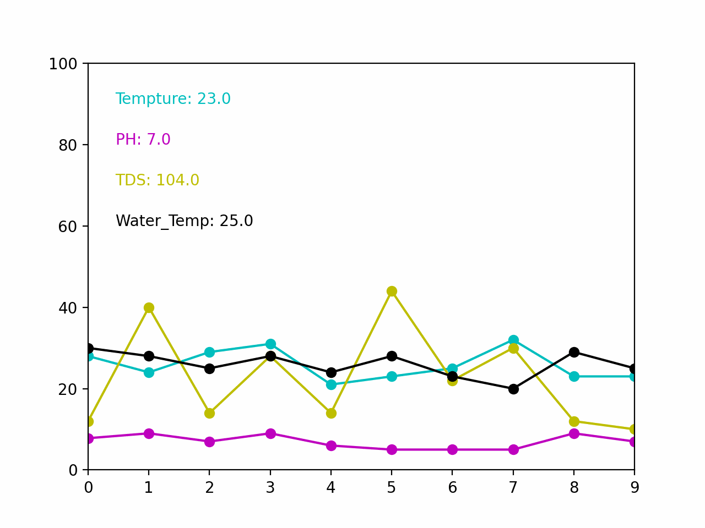

# Anaconda

1. Create a new environment `conda create --name <environment_name>`
2. Activate the environment `conda activate <environment_name>`
3. Install pip in environment `conda install pip`
4. Install requirements.txt `while read requirement; do conda install --yes $requirement || pip install $requirement; done < requirements.txt`
5. (Optional) Export requirements.txt `conda list --explicit > requirements.txt`

## install all the requirements
You can also use the following command to install all the requirements in one go
1. Export to .yml file `conda env export > freeze.yml`
2. To reproduce `conda env create -f freeze.yml`

> https://stackoverflow.com/questions/35802939/install-only-available-packages-using-conda-install-yes-file-requirements-t


## Try if the environment works

1. Activate conde envirements `conda activate <environment_name>`
2. Run main.py `python3 src/main.py`
3. If it works, you can deactivate the environment `conda deactivate`

---

# AWS


## AWS RDS

### Create a new RDS instance


### Set the security group(VPC) to allow access from your IP


### Connect to the RDS instance


## Lambda

### Create a new Lambda function


### Use the Lambda function to connect to the RDS instance


### Handle the Lambda function from the API Gateway


## API Gateway


### Create a new API Gateway

#### REST API


---


# Run the project


## Run the GPS data show in the browser

1. Activate conde envirements `conda activate <environment_name>`
2. Run main.py `python3 src/main.py`

## Show the Sensor data
1. Activate conde envirements `conda activate <environment_name>`
2. (Option)If you want to use the database, you need to change the `load_data()` to `load_data(False , connection)` and uncomment `connection = db_connection()` in previous line
    - N is the number of data you want to load from the database
3. Run show_data.py `python3 src/show_data.py`
4. You will get result images in the img folder

### Result images

|  |  |
|:-------------------------:|:-------------------------:|
|||

## Show the data realtime
1. Activate conde envirements `conda activate <environment_name>`


### Result Gif
<!-- animation.gif -->


## Query the database

### Delete or Create a new table from database

1. Uncomment `delete_table(connection)` or `create_table(connection)` in `src/sql_io.py`
2. Activate conde envirements `conda activate <environment_name>`
3. Run main.py `python3 src/sql_io.py`

### Create random data and insert into database
1. Uncomment the following code in `src/sql.py`
``` python

    for i in range(60):
        try :
            insert_data_random(connection)
            print("insert data success count: {}".format(i))
            time.sleep(2)
        except:
            print("Error inserting data , try again")
            time.sleep(1)
```
2. Activate conde envirements `conda activate <environment_name>`
3. Run main.py `python3 src/sql_io.py`

### Export data from database to csv file
1. Uncomment `save_data_to_csv(connection , name = boat_data_3)` in `src/sql_io.py`
    - You can change the name of the csv file by changing the `name` parameter
2. Activate conde envirements `conda activate <environment_name>`
3. Run main.py `python3 src/sql_io.py`

### Query last data from database
1. Uncomment `query_last_data(connection)` in `src/sql_io.py`
2. Activate conde envirements `conda activate <environment_name>`
3. Run main.py `python3 src/sql_io.py`


--- 

# To do list

`src/Dynamically_plot.py` 要加入即時從資料庫抓數據更新的功能

# Reference
https://hackmd.io/DekxmXS3TmGnyCDMNO2dgA?view